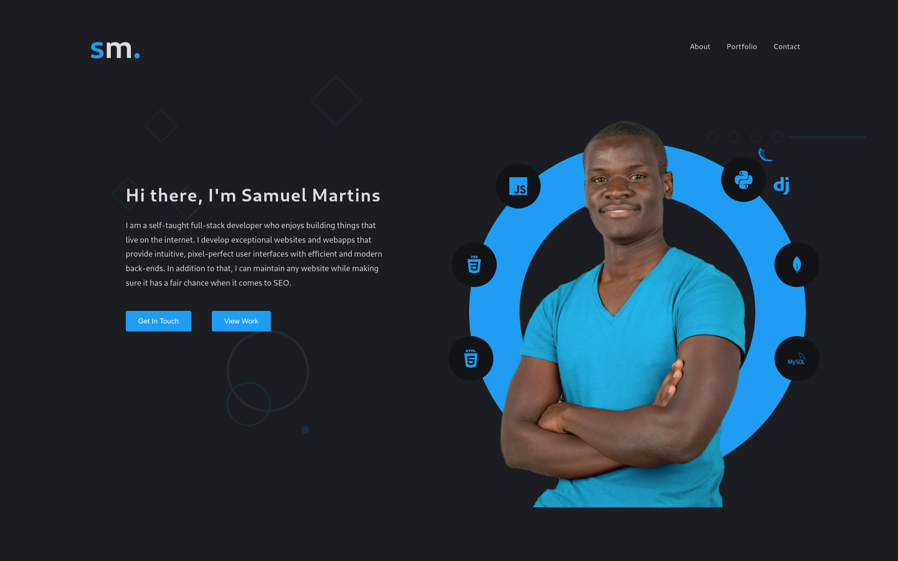

# Portfolio Landing page

By: Samuel Martins



## Description

This is a basic landing page for a portfolio. The goal of this project was to come up with something simple yet elegant to showcase work done for clients.

### Technologies

-   HTML5
-   CSS3
-   JS

## Usage

### 1. Local Repository

-   Make sure you have a stable internet to have the ability to clone the repository.
-   Type the following command in your terminal to clone this repository

```
git clone https://github.com/thesmartcoder7/portfolio-version-s.git
```

If you are using SSH, use the following command

```
git clone git@github.com:thesmartcoder7/portfolio-version-s.git
```

When you run the commands successfully, you should have a local version of this repository.

### 2. Online Repository

-   Make sure you have a stable internet for forking this repository.
-   According to the license, you can fork this project. You need to click on the forking icon and it will be added as one of your repositories. If you have ideas on ways you would upgrade this project, create a pull request with your changes. I'll be more than happy to go over them. Happy coding!

## License

Check out the license [here](LICENSE)

## Author Info

Name: Samuel Martins

-   Twitter - [@thesmartcoder7](https://twitter.com/thesmartcoder7)
-   Linkedin - [Samuel Martins](https://www.linkedin.com/in/samuel-martins-09839b115/)
-   Website - [Samuel Martins](https://smart-code.dev)
-   blog - [Samuel Martins](https://samuel-martins.medium.com/)
